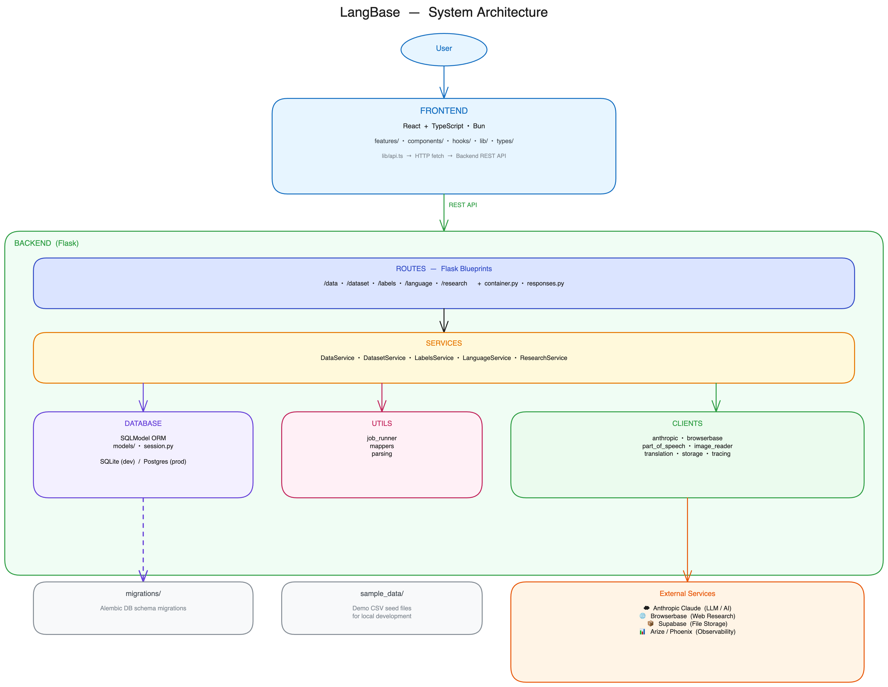

# LangBase

**A preservation tool for low-resource languages.**

LangBase gives linguists and community researchers a structured workspace to import raw text, annotate it with AI-assisted part-of-speech tagging, review translations, and run web research — all in a human-in-the-loop pipeline designed to keep humans in control of the data quality.

Built at the UC Berkeley AI Hackathon.

---

## Architecture



| Layer | Technology |
|---|---|
| Frontend | React + TypeScript, Bun |
| Backend | Python, Flask |
| ORM | SQLModel (SQLAlchemy + Pydantic) |
| Database | SQLite (dev) / Supabase Postgres (prod) |
| AI / LLM | Anthropic Claude |
| Web Research | Browserbase |
| File Storage | Supabase Storage |
| Observability | Arize / Phoenix (OpenTelemetry) |

---

## Features

- **Dataset workspaces** — create and manage named datasets per language
- **Data import** — paste text, upload CSVs, PDFs, or images
- **OCR** — extract text from images via Claude Vision
- **AI-assisted POS tagging** — token-level Universal Dependencies UPOS suggestions powered by Claude
- **Translation** — Spanish ↔ Nahuatl via Anthropic or a custom model endpoint
- **Web research** — Browserbase fetches and summarises language-specific research to ground annotations
- **Human review** — accept, reject, or edit every AI suggestion before it enters the dataset
- **Background jobs** — long-running tasks (OCR, POS, research) run in background threads; the UI polls for results
- **Observability** — optional Arize / Phoenix tracing for every LLM call

---

## Project Structure

```
ucb_ai_hackathon/
├── backend/                  Flask API
│   ├── main.py               Entry point
│   ├── app/
│   │   ├── __init__.py       Flask app factory (create_app)
│   │   ├── config.py         Settings (pydantic-settings)
│   │   ├── schemas.py        Pydantic request / response schemas
│   │   ├── exceptions.py     Custom errors
│   │   ├── routes/           Flask Blueprints — one folder per domain
│   │   │   ├── data/         Text & file import
│   │   │   ├── dataset/      Dataset CRUD + dashboard
│   │   │   ├── labels/       POS / translation / OCR review
│   │   │   ├── language/     Language translation endpoint
│   │   │   └── research/     Browserbase research jobs
│   │   ├── database/
│   │   │   ├── models/       SQLModel table definitions
│   │   │   └── session.py    Engine + request-scoped session
│   │   ├── clients/          External service wrappers
│   │   │   ├── anthropic.py
│   │   │   ├── browserbase.py
│   │   │   ├── part_of_speech.py
│   │   │   ├── image_reader.py
│   │   │   ├── translation.py
│   │   │   ├── storage.py
│   │   │   └── tracing.py
│   │   └── utils/
│   │       ├── job_runner.py  Background job state management
│   │       ├── mappers.py     DB model → API schema converters
│   │       └── parsing.py     File type detection + CSV parsing
│   ├── migrations/            Alembic DB migrations
│   ├── tests/                 pytest integration tests
│   └── scripts/               One-off data utility scripts
│
├── frontend/                  React + TypeScript UI
│   └── src/
│       ├── features/          Feature modules (upload, labels, research, …)
│       ├── components/        Shared layout + UI primitives
│       ├── hooks/             Data-fetching and workspace state hooks
│       ├── lib/               API client, constants, formatters
│       └── types/             Shared domain types
│
└── sample_data/               Demo CSV files for local seeding
└── resources/                 Diagrams and other project assets
```

---

## Getting Started

### Prerequisites

| Tool | Version |
|---|---|
| Python | 3.11+ |
| [uv](https://docs.astral.sh/uv/) | latest |
| [Bun](https://bun.sh) | 1.x |

### 1 — Clone

```bash
git clone https://github.com/GaelGil/ucb_ai_hackathon.git
cd ucb_ai_hackathon
```

### 2 — Backend

```bash
cd backend

# Install dependencies
uv sync

# Copy the example env file and fill in your keys
cp .env.example .env

# Run the server (SQLite, with demo data seeded)
CREATE_DB_ON_STARTUP=true SEED_DEMO_DATA=true uv run python main.py
```

The API is now available at **http://localhost:8000**.

### 3 — Frontend

```bash
cd frontend

# Install dependencies
bun install

# Start the dev server
bun dev
```

Open **http://localhost:3000** in your browser.

---

## Configuration

All settings are loaded from `backend/.env` (or real environment variables). Copy `.env.example` and fill in what you need.

| Variable | Default | Description |
|---|---|---|
| `DATABASE_URL` | `sqlite:///./langbase.db` | SQLAlchemy URL — use Supabase Postgres in prod |
| `CREATE_DB_ON_STARTUP` | `false` | Auto-create tables on boot (useful for local SQLite) |
| `SEED_DEMO_DATA` | `false` | Seed a Nahuatl demo dataset on first boot |
| `ANTHROPIC_API_KEY` | — | Enables Claude-powered POS, OCR, translation, and research |
| `BROWSERBASE_API_KEY` | — | Enables live web research |
| `SUPABASE_URL` | — | Required for cloud file storage |
| `SUPABASE_SERVICE_ROLE_KEY` | — | Supabase service key |
| `SUPABASE_STORAGE_BUCKET` | `langbase-uploads` | Bucket name |
| `ANTHROPIC_MODEL` | `claude-sonnet-4-5` | Claude model to use |
| `NAHUATL_MODEL_ENDPOINT_URL` | — | Custom translation endpoint (falls back to Claude) |
| `PHOENIX_ENABLED` | `false` | Enable Phoenix / Arize tracing |
| `PHOENIX_OTEL_ENDPOINT` | `http://localhost:6006/v1/traces` | OTLP trace endpoint |

> **Missing keys are safe.** All external providers fall back to demo mode when credentials are absent so the UI stays usable.

---

## Running Tests

```bash
cd backend
uv run pytest
```

Tests run fully offline — no real API keys, no network, no Postgres. A fresh in-memory SQLite database is created for each test session.

---

## API Overview

| Method | Path | Description |
|---|---|---|
| `GET` | `/health` | Health check |
| `GET/POST` | `/datasets` | List / create datasets |
| `GET/PATCH/DELETE` | `/datasets/{id}` | Get / update / delete a dataset |
| `GET` | `/datasets/{id}/dashboard` | Aggregated stats for a dataset |
| `POST` | `/datasets/{id}/import/text` | Import plain text rows |
| `POST` | `/datasets/{id}/import/csv` | Import a CSV file |
| `GET` | `/datasets/{id}/data` | Paginated data rows |
| `GET` | `/datasets/{id}/labels` | Paginated label suggestions |
| `POST` | `/datasets/{id}/labels/{row_id}/accept` | Accept a suggestion |
| `POST` | `/datasets/{id}/labels/{row_id}/reject` | Reject a suggestion |
| `POST` | `/datasets/{id}/pos` | Trigger POS annotation job |
| `POST` | `/datasets/{id}/translate` | Trigger translation job |
| `POST` | `/datasets/{id}/research` | Trigger web research job |
| `GET` | `/datasets/{id}/jobs` | List background jobs |

---

## Database Migrations

After changing a model in `app/database/models/`, generate and apply a migration:

```bash
cd backend

# Generate
uv run alembic revision --autogenerate -m "describe your change"

# Apply
uv run alembic upgrade head
```

Other useful commands:

```bash
uv run alembic current      # Show current revision
uv run alembic history      # Full migration history
uv run alembic downgrade -1 # Roll back one step
```